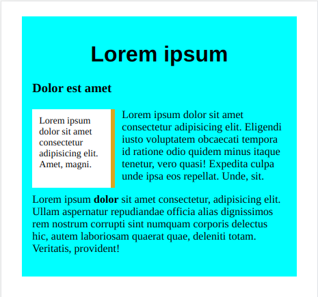

# css405

 

A feladatsor Sallai András munkája alapján készült

https://szit.hu/doku.php?id=oktatas:web:feladatok:css

Szerző: Szilágyi Gábor Dániel
-------------------------------
1. A fájl neve legyen index.html

2. Vegyen fel egy div elemet, jelölje .container osztállyal.

3. A .container dobozon belül legyen egy 1-s szintű fejezetcím, oda kerüljön a Lorem ipsum cím.

4. A h1 után legyen egy alcím h3 elemben, oda kerüljön az alcím: Dolor sit amet.

5. A h3 után legyen egy üres aside doboz, 10 szavas lorem ipsum szöveggel.

6. Ezt kövesse egy p elem, lorem ipsum szöveg van, alapértelmezett szószámmal.

7. Legyen a p elem után egy másik p elem, szintén lorem ipsum alapszöveggel.

8. Linkelje a style.css nevű állományt stíluslapként. Használja a style.css fájlt a további feladatoknál.

9. A .container doboz számára állítson be 5%-s margót.

10. A .container doboz számára állítson be cyan háttérszínt.

11. A .container doboz számára állítson be 15 pixeles belső margót.

12. A h1 elem számára állítson be talpatlan betűtípust.

13. A h1 elem számára állítson be középre igazított tartalmat.

14. Az aside elem számára állítson be 95 pixeles szélességet és magasságot.

15. Az aside tartalmának fontmérete legyen 14 pixel.

16. Az aside háttérszíne legyen fehér.

17. Az aside számára állítson be 10 pixeles belső margót.

18. Az aside elemet lebegtesse balra.

19. Az aside elemnek állítson be 10 pixeles jobboldali margót.

20. Az aside elem jobb szélén állítson be szegélyt, ami 6 pixel széles, solid típus és a színe goldenrod.

20. Az utolsó bekezdés harmadik szavátnak, ami „dolor” állítson be félkövér fontot CSS-el. Ha szükséges szerkessze a HTML fájlt.

---------------------------------
